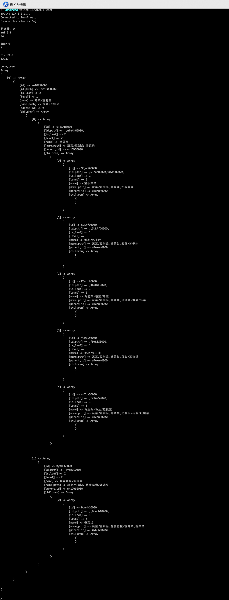

### 致面试官
> 因个人环境问题，做题过程没有使用腾讯会议过程录屏。
> 以下题目，因能力问题，本人从晚上12点-凌晨3:50完成编码，期间借鉴了谷歌、PHP.net 网站。
> 若答题代码不满足贵司条件，可让人事通过微信告知即可，无需浪费面试官时间。

### 第一步：为框架添加文本协议支持
> 运行方式：
> 1、开启服务：yii jjb/tcp-server
> 2、客户端监听：telnet 127.0.0.1 9999

### 第二步：增加新功能 conv_tree
> 效果截图：
> 
